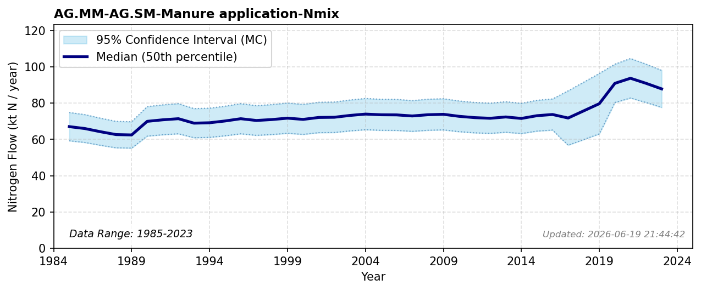

# Manure Application

### Flow Description
Taken from EUROSTAT Gross nutrient balance as advised by \\citet{schappi_annexes_2025}. We interpolate the missing values between 2016 and 2020.

### References


