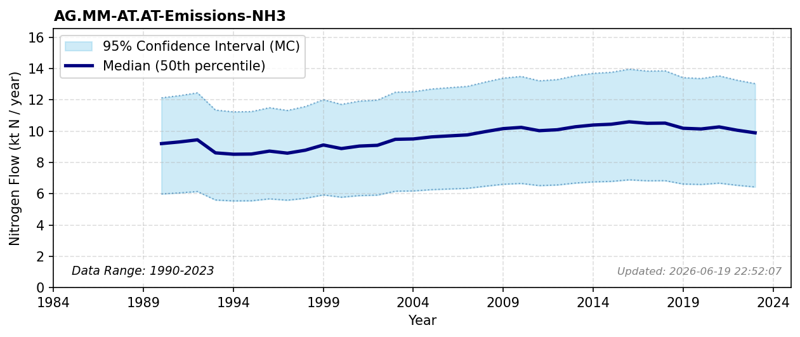

# Manure Emissions (NH3)

### Flow Description
We have used data from CLRTAP Inventory Submissions \\citep{emep_officially_2025} as advised by \\citet{schappi_annexes_2025}, using the categories given in Table 29.

### References


