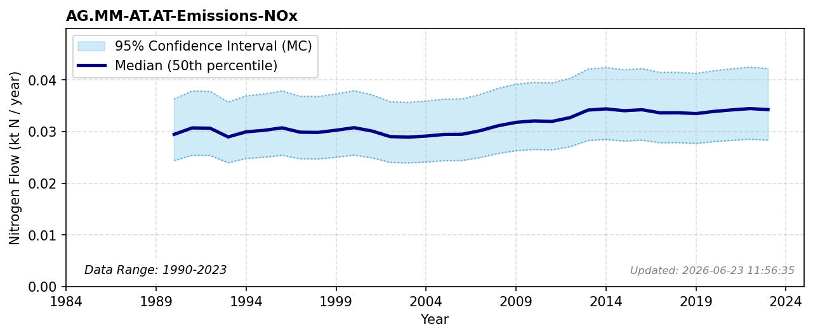

# Manure Emissions (NOx)

### Flow Description
We have used data from CLRTAP Inventory Submissions \\citep{emep_officially_2025} as advised by \\citet{schappi_annexes_2025}, using the categories given in Table 29.

### References

* EMEP (2025). *Officially reported emission data*.
* Schäppi (2025). *Annexes to the {Guidance} {Document} on {NNB*.
