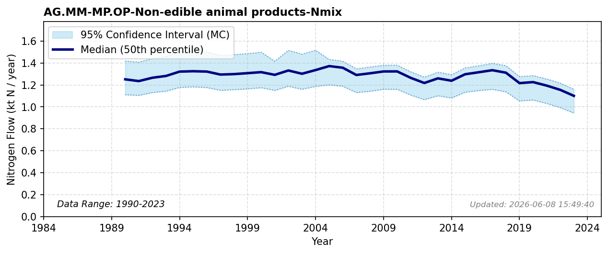

# Non-edible Animal Products

### Flow Description
Schäppi (2025) advises using FAOSTAT Commodity Balances (non-food). For Norway this statistic only contains wool for 4 individual years and we therefore use data for wool from Landbruksdirektoratet (landbruksdirektoratet_leveransedata_2025) for 2005-2024; for earlier years, we use the number of sheep (SSB table 03710) and extrapolate from a linear regression found between sheep and wool for 2005-2024. In addition, we use numbers for raw hides and skins from FAOSTAT Crops and livestock products. N contents are taken from Schäppi (2025).

### References

* Missing reference data for key: `landbruksdirektoratet_leveransedata_2025`
* Schäppi (2025). *Annexes to the {Guidance} {Document} on {NNB*.
