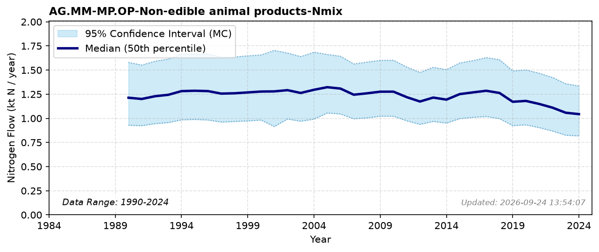

# Non-edible Animal Products

### Flow Description
Schäppi et al. (2025) advises using FAOSTAT Commodity Balances (non-food). For Norway this statistic only contains wool for 4 individual years and we therefore use data for wool from Landbruksdirektoratet (Landbruksdirektoratet, 2025) for 2005-2024; for earlier years, we use the number of sheep (SSB table 03710) and extrapolate from a linear regression found between sheep and wool for 2005-2024. In addition, we use numbers for raw hides and skins from FAOSTAT Crops and livestock products. N contents are taken from Schäppi et al. (2025).

### References

* Landbruksdirektoratet (2025). *leveransedata-slakt-2005-2012*. [https://github.com/LandbruksdirektoratetGIT/opendata/tree/main/datasets/leveransedata-slakt-2005-2012](https://github.com/LandbruksdirektoratetGIT/opendata/tree/main/datasets/leveransedata-slakt-2005-2012)
* Schäppi, B., Reutimann, J., Bogler, S., & Ehrler, A. (2025). *Detailed Annexes to ECE/EB.AIR/119 – “Guidance document on national nitrogen budgets*. [https://www.clrtap-tfrn.org/sites/default/files/2025-05/Annexes%20to%20the%20Guidance%20Document%20on%20NNB.pdf](https://www.clrtap-tfrn.org/sites/default/files/2025-05/Annexes%20to%20the%20Guidance%20Document%20on%20NNB.pdf)
