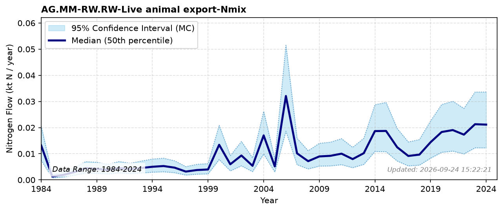

# Live Animal Export

### Flow Description
Taken from FAOSTAT Crop and livestock products, assuming typical weights of animals from various sources, average 16 % protein in whole animal based on typical values in Schäppi et al. (2025) and Jones factor 6.25 for nitrogen to protein (standard).

### References

* Schäppi, B., Reutimann, J., Bogler, S., & Ehrler, A. (2025). *Detailed Annexes to ECE/EB.AIR/119 – “Guidance document on national nitrogen budgets*. [https://www.clrtap-tfrn.org/sites/default/files/2025-05/Annexes%20to%20the%20Guidance%20Document%20on%20NNB.pdf](https://www.clrtap-tfrn.org/sites/default/files/2025-05/Annexes%20to%20the%20Guidance%20Document%20on%20NNB.pdf)
