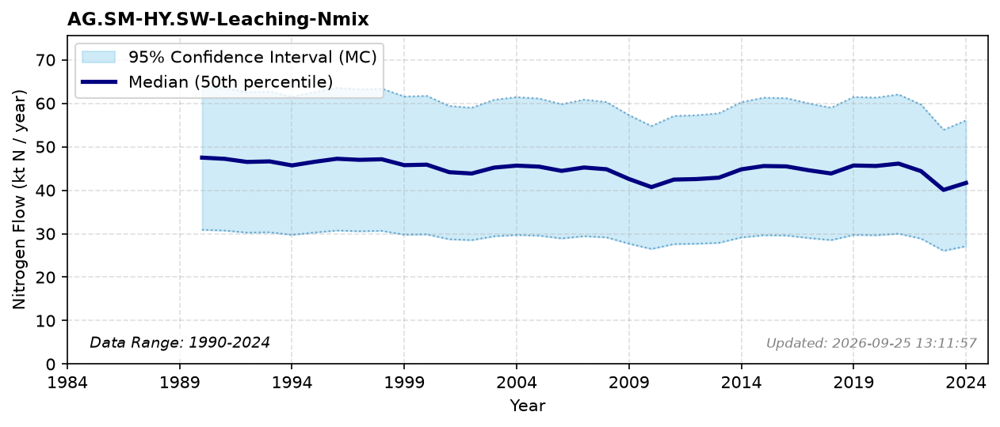

# Leaching from soil management

### Flow Description
Leaching from soil management is taken from UNFCCC Common reporting tables, Table 3. The data agrees within the error range with what is reported in the TEOTIL3 Sample (2024).

### References

* Sample, J. E. (2024). *Kildefordelte tilførsler av nitrogen og fosfor til norske kystområder i 2022 – tabeller, figurer og kart*.
