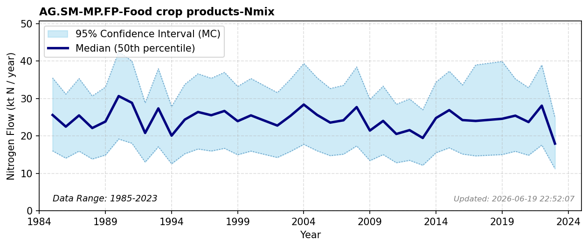

# Food crop products

### Flow Description
Food crop products are  taken from EUROSTAT Gross nutrient balance as advised by Schäppi et al. (2025): «Nutrient removal by harvest of crops» minus «Industrial crops». «Ornamenal crops», which should also be removed, are negligible in Norway. For years with missing data, we have filled in the average of all other years.

### References

* Schäppi, B., Reutimann, J., Bogler, S., & Ehrler, A. (2025). *Detailed Annexes to ECE/EB.AIR/119 – “Guidance document on national nitrogen budgets*. https://www.clrtap-tfrn.org/sites/default/files/2025-05/Annexes%20to%20the%20Guidance%20Document%20on%20NNB.pdf
