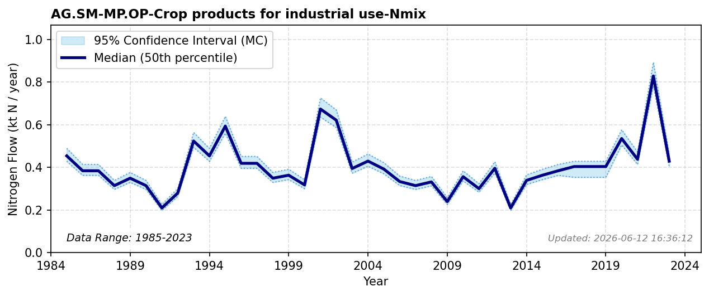

# Crop products for industrial use

### Flow Description
Crop products for industrial use is taken from EUROSTAT Gross nutrient balance as advised by Schäppi et al. (2025). For years with missing data, we have filled in the average of all other years.

### References

* Schäppi, B., Reutimann, J., Bogler, S., & Ehrler, A. (2025). *Detailed Annexes to ECE/EB.AIR/119 – “Guidance document on national nitrogen budgets*. https://www.clrtap-tfrn.org/sites/default/files/2025-05/Annexes%20to%20the%20Guidance%20Document%20on%20NNB.pdf
