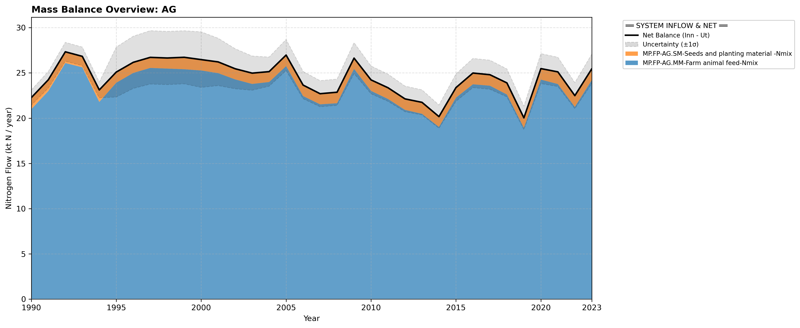

# Pool: Agriculture (AG)

Because biofuel production in Norway is typically done as part of the waste management sector, flows of agricultural wastes to biofuel production are directed to PR.SO and we do not include the subpool AG.BC.

This pool is divided into two operational sub-pools. Explore them using the side menu or links below:

* [Manure Management (AG.MM)](subpool_manure_management.html)
* [Soil Management (AG.SM)](subpool_soil_management.html)

---

## Mass Balance Overview (1990-2023)

The chart below illustrates the integrated nitrogen mass balance for **AG**. It includes total system inflows (positive stack), total outflows (negative stack), and the net balance line with estimated uncertainty bounds (±1σ).

