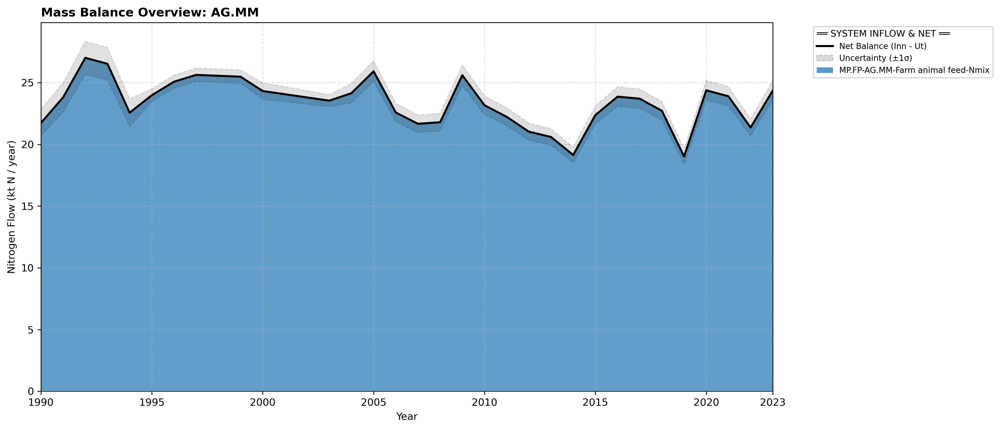

# Subpool: Manure management, storage and animal husbandry (AG.MM)

---

## Mass Balance Overview (1990-2023)

The chart below illustrates the integrated nitrogen mass balance for **AG.MM**. It includes total system inflows (positive stack), total outflows (negative stack), and the net balance line with estimated uncertainty bounds (±1σ).

### Flows that are zero or neglected:

* **AG.MM-RW.RW-Manure export-Nmix** is assumed small and neglected.(Schulte-Uebbing, 2022)

* **AG.MM-PR.SO-Manure for biofuel production-Nmix** is neglected because the Eurostat data used to calculate manure application to soil includes manure that has been processed for biogas. SSB table 12359 gives the amount of manure processed for biogas or through composting. Composting values are negligible compared with biogas.  The nitrogen content of manure for biogas production is found to rise from zero before 2012 to around 0.5 kt/year in 2023 (data from Landbruksdirektoratet (2025), a value which is still negligible compared with the total amount of manure application. We therefore do not introduce a correction for the amount of nitrogen lost through biogas processing.

### References

* Landbruksdirektoratet (2025). *Biogass*. [https://www.landbruksdirektoratet.no/nb/statistikk-og-utviklingstrekk/statistikk-over-miljotilskudd-i-jordbruket/biogass](https://www.landbruksdirektoratet.no/nb/statistikk-og-utviklingstrekk/statistikk-over-miljotilskudd-i-jordbruket/biogass)
* Schulte-Uebbing, L. F., Beusen, A. H. W., Bouwman, A. F., & de Vries, W. (2022). *From planetary to regional boundaries for agricultural nitrogen pollution*. Nature. [https://doi.org/10.1038/s41586-022-05158-2](https://doi.org/10.1038/s41586-022-05158-2)
