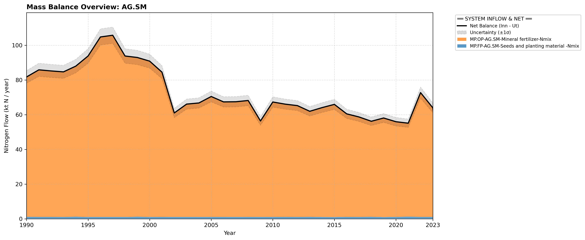

# Subpool: Soil management (AG.SM)

---

## Mass Balance Overview (1990-2023)

The chart below illustrates the integrated nitrogen mass balance for **AG.SM**. It includes total system inflows (positive stack), total outflows (negative stack), and the net balance line with estimated uncertainty bounds (±1σ).

### Flows that are zero or neglected:

* **AG.SM-HY.SW-Overland flow-Nmix** is not included because all runoff and leaching is included in Leaching.
