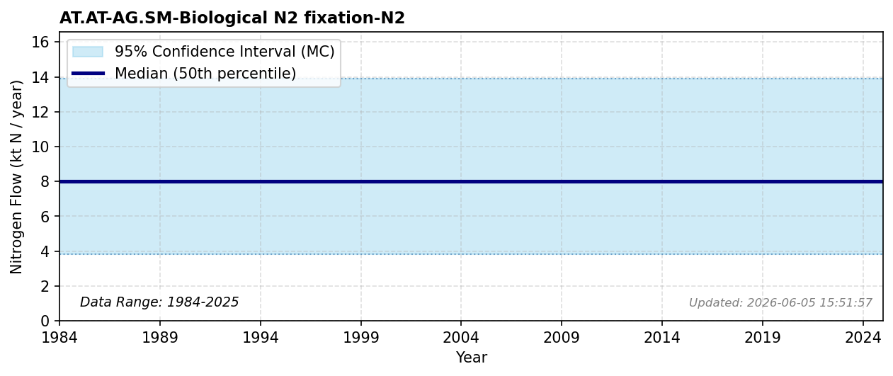

# AG SM Biological N2 fixation N2

### Flow Description
**AT.AT-AG.SM-Biological N2 fixation-N2**

[^Schäppi2025] advises using data from the EUROSTAT Gross nutrient balance, but there is an error in this dataset for Norway which is currently being corrected (as of February 2026; personal correspondence, EUROSTAT). According to the EUROSTAT metadata, the BNF in this statistic is calculated based on the area of leguminous crops and fixation coefficients. The production of leguminous crops (peas, beans etc) in Norway is very low and we assume that agricultural BNF for the most part determined by leguminous crops such as clover grown on pastures and in fodder production.

(Bleken & Bakken, 1997) based their estimate for BNF from the sale of clover seeds: a sale of about 145 t seeds was estimated to be used to plant 95 000 ha of grass/clover mixtures (655 ha/t seeds). Together with a rate of BNF of 80 kgN/ha on this area, they found a total of 7.6 ktN per year and summed up to 8 ktN to account for BNF from free-living organisms and other sources. The rate of 80 kgN/ha agrees relatively well with later studies of agricultural BNF in Norway, where average values between 10 and 100 kgN/ha have been found; the highest values in particularly productive areas were up to 260 kgN/ha. Yearly statistics of clover seed sales are not available, but according to NIBIO Totalkalkylen [^NIBIO2025b], the area where grass/clover mixes may be sown for pasture and fodder production (fulldyrka eng) has remained constant to within about 3 % from 1995 up to today. Our best estimate for BNF, and for consistency with the previous study, is therefore to assume a constant value of 8 ktN/year. In Sweden [^Moldan2025] the value was found to be 34 kT in 2015, which is more in line with the values found before 2000.

### References

*No reference file found.*
