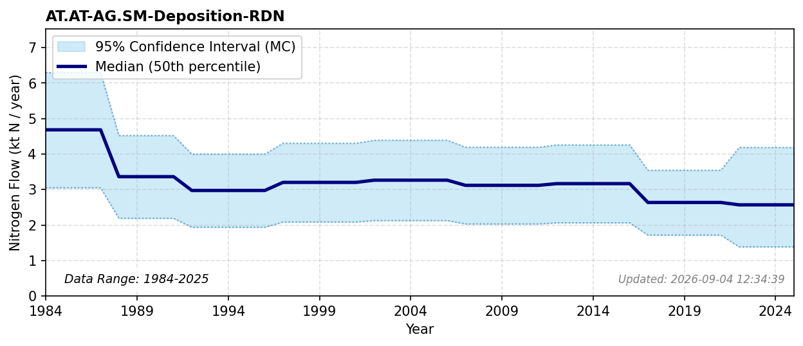

# Reduced N Deposition (Agricultural Soils)

### Flow Description
**AT.AT-AG.SM-Deposition-RDN**

Deposition of N to agricultural soils is one of five land-class deposition flows derived from the same NILU/AR5 dataset; see the [Atmospheric Nitrogen Deposition Overview](pool_atmosphere.html) on the 7. Atmosphere (AT) pool page for the shared methodology, period structure and national totals.

