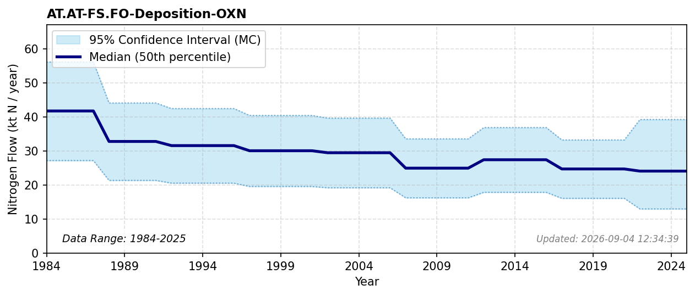

# Oxidized N Deposition (Forest)

### Flow Description
**AT.AT-FS.FO-Deposition-OXN**

Deposition of N to forest is one of five land-class deposition flows derived from the same NILU/AR5 dataset; see the [Atmospheric Nitrogen Deposition Overview](pool_atmosphere.html) on the 7. Atmosphere (AT) pool page for the shared methodology, period structure and national totals.

