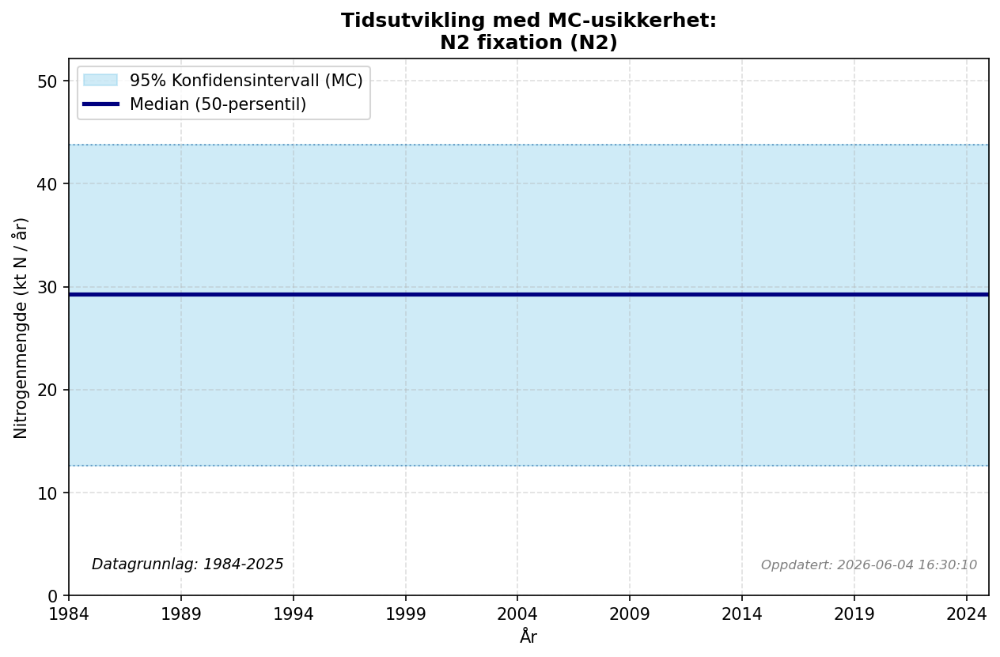

# Biological N2 Fixation (Other Land)

### Flow Description
We use N2 fixation rates from Table 62 in Schäppi et al. (2025) together with land type areas calculated from the CORINE land cover  inventory Agency (2019). In the Swedish NNB (Moldan et al., 2025), N2 fixation in the OL compartment was considered negligible.

### References

* European Environment Agency (2019). *CORINE Land cover inventory*. [https://www.eea.europa.eu/en/datahub/datahubitem-view/a5144888-ee2a-4e5d-a7b0-2bbf21656348](https://www.eea.europa.eu/en/datahub/datahubitem-view/a5144888-ee2a-4e5d-a7b0-2bbf21656348)
* Moldan, F., Stadmark, J., Jutterström, S., & Ljunggren, J. (2025). Where does Sweden’s nitrogen go? Building a comprehensive national nitrogen budget. *Environmental Research Letters, 20*(12), 124068. [https://doi.org/10.1088/1748-9326/ae2697](https://doi.org/10.1088/1748-9326/ae2697)
* Schäppi, B., Reutimann, J., Bogler, S., & Ehrler, A. (2025). *Detailed Annexes to ECE/EB.AIR/119 – “Guidance document on national nitrogen budgets*. [https://www.clrtap-tfrn.org/sites/default/files/2025-05/Annexes%20to%20the%20Guidance%20Document%20on%20NNB.pdf](https://www.clrtap-tfrn.org/sites/default/files/2025-05/Annexes%20to%20the%20Guidance%20Document%20on%20NNB.pdf)
