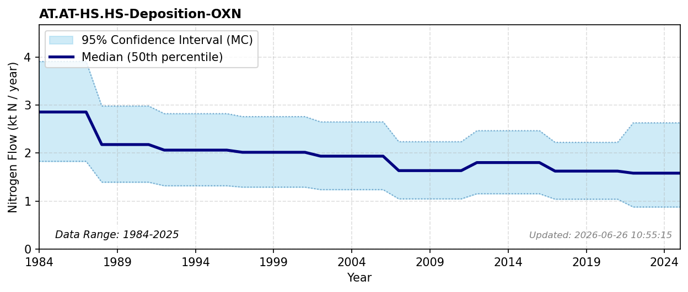

# Oxidized N Deposition (Settlements)

### Flow Description
**AT.AT-HS.HS-Deposition-OXN**

Atmospheric deposition was calculated using data from NILU which gives gridded deposition data for both oxidized and reduced N as averages for periods 1983-1987, 1988-1992, 1997-2001, 2002-2006, 2007-2011 and 2012-2016. For 2017-2021 we use total NILU data for that period and scale with the distribution across land classes for the previous period. Values after 2021 are extrapolated. To find deposition on different land categories we use the map resource AR5 from NIBIO NIBIO (2016). We find the total value of atmospheric deposition to the Norwegian mainland is, as given by NILU, 142 ktN in 2012-2016.

As noted, our value for agricultural soils is much larger than given by FAOSTAT. Hohmann-Marriott (2025) used values from Blake (2023) to arrive at an average N deposition rate of 80.85 ktN for the period 2017-2021. Hohmann-Marriott (2025) also reported values of 74.7 and 33.5 ktN per year using two different methods for estimating biome-dependent N deposition rates.

### References

* Blake, Lewis R and Aas, Wenche and Denby, Bruce and Hjellbrekke, Anne and Mu, Qing and Simpson, David and Fagerli, Hilde (2023). *Deposition of sulfur and nitrogen in {Norway} 2017-2021*.
* Hohmann-Marriott, Martin F. (2025). *A Nitrogen budget for Norway analysis of Nitrogen flows from societal and natural sources (1961–2020)*. PLOS ONE. [https://dx.plos.org/10.1371/journal.pone.0313598](https://dx.plos.org/10.1371/journal.pone.0313598)
* NIBIO (2016). *AR5*. [https://www.nibio.no/tema/jord/arealressurser/arealressurskart-ar5?locationfilter=true](https://www.nibio.no/tema/jord/arealressurser/arealressurskart-ar5?locationfilter=true)
