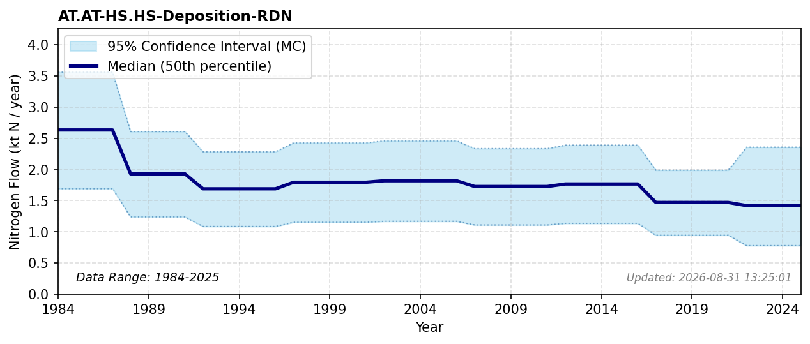

# Reduced N Deposition (Settlements)

### Flow Description
**AT.AT-HS.HS-Deposition-RDN**

Deposition of N to settlements is one of five land-class deposition flows derived from the same NILU/AR5 dataset; see the [Atmospheric Nitrogen Deposition Overview](pool_atmosphere.html) on the Atmosphere (AT) pool page for the shared methodology, period structure and national totals.

