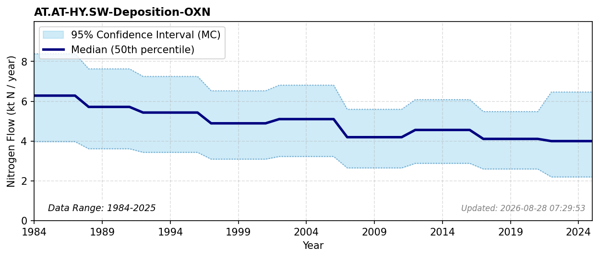

# Oxidized N Deposition (Surface Water)

### Flow Description
**AT.AT-HY.SW-Deposition-OXN**

Atmospheric deposition was calculated using data from NILU (described in Blake et al. (2023)) which gives gridded deposition data for both oxidized and reduced N as averages for periods 1983-1987, 1988-1992, 1997-2001, 2002-2006, 2007-2011 and 2012-2016. For 2017-2021 we use total NILU data for that period and scale with the distribution across land classes for the previous period. Values after 2021 are extrapolated. To find deposition on different land categories we use the map resource AR5 from NIBIO (NIBIO, 2016). We find the total value of atmospheric deposition to the Norwegian mainland is, as given by NILU, 142 ktN in 2012-2016.

For comparison, the data used in the TEOTIL model gives 3.5 ktN in 2013 and 3.0 ktN in 2023 - a similar declining trend to our combined OXN+RDN values (about 9.4 and 8.1 ktN for the same years), but substantially lower in magnitude, likely reflecting different datasets and different data treatment.

### References

* Blake, L. R., Aas, W., Denby, B., Hjellbrekke, A., Mu, Q., Simpson, D., & Fagerli, H. (2023). *Deposition of sulfur and nitrogen in Norway 2017-2021*.
* NIBIO (2016). *AR5*. [https://www.nibio.no/tema/jord/arealressurser/arealressurskart-ar5?locationfilter=true](https://www.nibio.no/tema/jord/arealressurser/arealressurskart-ar5?locationfilter=true)
