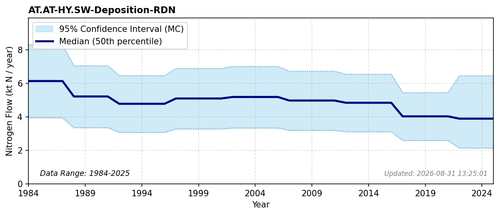

# Reduced N Deposition (Surface Water)

### Flow Description
**AT.AT-HY.SW-Deposition-RDN**

Deposition of N to surface waters is one of five land-class deposition flows derived from the same NILU/AR5 dataset; see the [Atmospheric Nitrogen Deposition Overview](pool_atmosphere.html) on the Atmosphere (AT) pool page for the shared methodology, period structure and national totals.

For comparison, the data used in the TEOTIL model gives 3.5 ktN in 2013 and 3.0 ktN in 2023 - a similar declining trend to our combined OXN+RDN values (about 9.4 and 8.1 ktN for the same years), but substantially lower in magnitude, likely reflecting different datasets and different data treatment. 