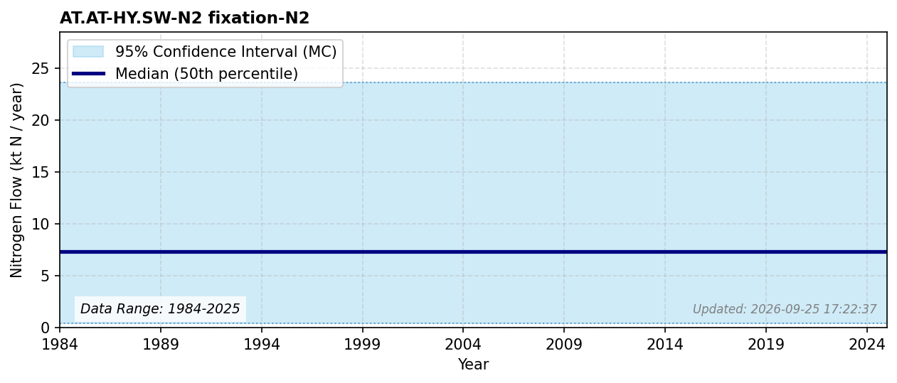

# Biological N2 Fixation (Surface Water)

### Flow Description
**AT.AT-HY.SW-N2 fixation-N2**

According to NIBIO (NIBIO, 2026), the surface water area is 20 457 km2 https://arealbarometer.nibio.no/nb/norge/. According to Schäppi et al. (2025), the biological fixation rate can vary between < 0.1 tN/km2 in ologotrophic and mesotrophic lakes to up to 10 tN/km2 in eutrophic lakes. Most lakes in Norway are not eutrophic and we use a median value of 0.1 tN/km2, with highest and lowest values of 0 and 2 tN/km2.

### References

* NIBIO (2026). Arealbarometer for Norge. *nibio.no*. [https://arealbarometer.nibio.no/nb/norge/](https://arealbarometer.nibio.no/nb/norge/)
* Schäppi, B., Reutimann, J., Bogler, S., & Ehrler, A. (2025). *Detailed Annexes to ECE/EB.AIR/119 – “Guidance document on national nitrogen budgets*. [https://www.clrtap-tfrn.org/sites/default/files/2025-05/Annexes%20to%20the%20Guidance%20Document%20on%20NNB.pdf](https://www.clrtap-tfrn.org/sites/default/files/2025-05/Annexes%20to%20the%20Guidance%20Document%20on%20NNB.pdf)
