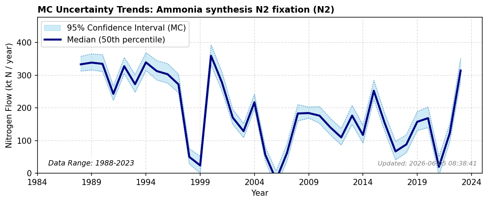

# Ammonia Synthesis N2 Fixation

### Flow Description
**AT.AT-MP.OP-Ammonia synthesis N2 fixation-N2**

is found through mass balance where we use data from FAOSTAT Fertilizer by nutrient, domestic fertilizer production, and subtracted the amount of ammonia imported from SSB trade data (table 08801). The result is a very variable curve which probably does not reflect year to year production well and could be a result of how trade statistics are reported.