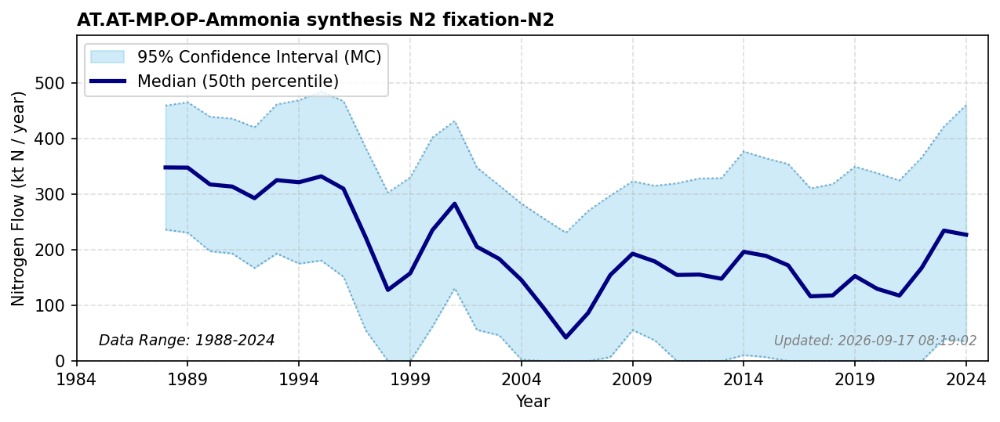

# Ammonia Synthesis N2 Fixation

### Flow Description
**AT.AT-MP.OP-Ammonia synthesis N2 fixation-N2**

is found through mass balance where we use data from FAOSTAT Fertilizer by nutrient, domestic fertilizer production, and adjusted for trade in ammonia using SSB trade data (table 08801): imported ammonia is subtracted (not domestically fixed) and exported ammonia is added back (domestically fixed before leaving the country). This combined value is smoothed with a centered 3-year moving average, since actual ammonia production is a continuous industrial process and presumably much steadier than the underlying trade statistics suggest on their own - annual trade figures are sensitive to shipment timing around year-end and to inventory/stock effects, which can otherwise dominate the apparent year-to-year change. The result is floored at zero, since a negative N2-fixation flow has no physical meaning.