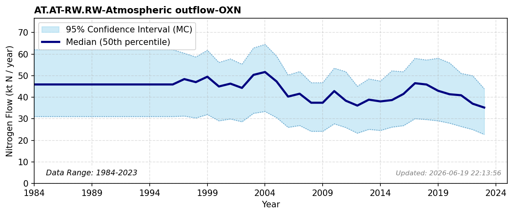

# Atmospheric Outflow (Oxidized N)

### Flow Description
**AT.AT-RW.RW-Atmospheric outflow-OXN**

is found using source-receptor data from (EMEP, 2024), as advised by (Schäppi et al., 2025).

### References

* EMEP (2024). *SR} country tables*. [https://www.emep.int/mscw/mscw_srdata.html](https://www.emep.int/mscw/mscw_srdata.html)
* Schäppi, B., Reutimann, J., Bogler, S., & Ehrler, A. (2025). *Detailed Annexes to ECE/EB.AIR/119 – “Guidance document on national nitrogen budgets*. [https://www.clrtap-tfrn.org/sites/default/files/2025-05/Annexes%20to%20the%20Guidance%20Document%20on%20NNB.pdf](https://www.clrtap-tfrn.org/sites/default/files/2025-05/Annexes%20to%20the%20Guidance%20Document%20on%20NNB.pdf)
