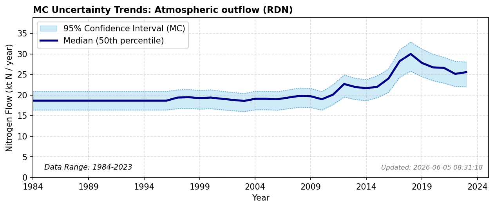

# AT.AT-RW.RW-Atmospheric outflow-RDN

### Flow Description
**AT.AT-RW.RW-Atmospheric outflow-RDN**

Is found using source-receptor data from EMEP [^EMEP2024], as advised by [^Schäppi2025].

### References

*No reference file found.*
