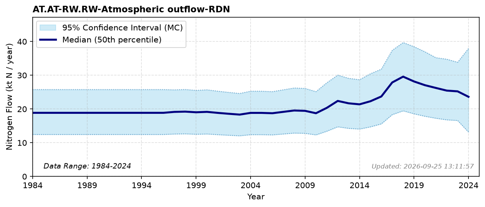

# Atmospheric Outflow (Reduced N)

### Flow Description
**AT.AT-RW.RW-Atmospheric outflow-RDN**

is found using source-receptor data from (EMEP, 2024), as advised by (Schäppi et al., 2025). The EMEP source-receptor tables are not published for every year: 1984-1996 use the average of 1997-2001 (the earliest available years); the single missing years 2011, 2015 and 2022 use the average of the surrounding years; and 2019-2020 are linearly interpolated between 2018 and 2021.

### References

* EMEP (2024). *SR country tables*. [https://www.emep.int/mscw/mscw_srdata.html](https://www.emep.int/mscw/mscw_srdata.html)
* Schäppi, B., Reutimann, J., Bogler, S., & Ehrler, A. (2025). *Detailed Annexes to ECE/EB.AIR/119 – “Guidance document on national nitrogen budgets*. [https://www.clrtap-tfrn.org/sites/default/files/2025-05/Annexes%20to%20the%20Guidance%20Document%20on%20NNB.pdf](https://www.clrtap-tfrn.org/sites/default/files/2025-05/Annexes%20to%20the%20Guidance%20Document%20on%20NNB.pdf)
