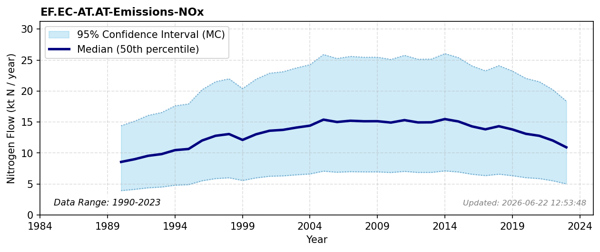

# Energy conversion emissions (NOx)

### Flow Description
EF.EC-AT.AT-Emissions-NOx: We have used data from CLRTAP Inventory Submissions EMEP (2025) as advised by Schäppi et al. (2025), using the categories given in Table 11

### References

* EMEP (2025). *Officially reported emission data*. [https://www.ceip.at/webdab-emission-database/reported-emissiondata](https://www.ceip.at/webdab-emission-database/reported-emissiondata)
* Schäppi, B., Reutimann, J., Bogler, S., & Ehrler, A. (2025). *Detailed Annexes to ECE/EB.AIR/119 – “Guidance document on national nitrogen budgets*. [https://www.clrtap-tfrn.org/sites/default/files/2025-05/Annexes%20to%20the%20Guidance%20Document%20on%20NNB.pdf](https://www.clrtap-tfrn.org/sites/default/files/2025-05/Annexes%20to%20the%20Guidance%20Document%20on%20NNB.pdf)
