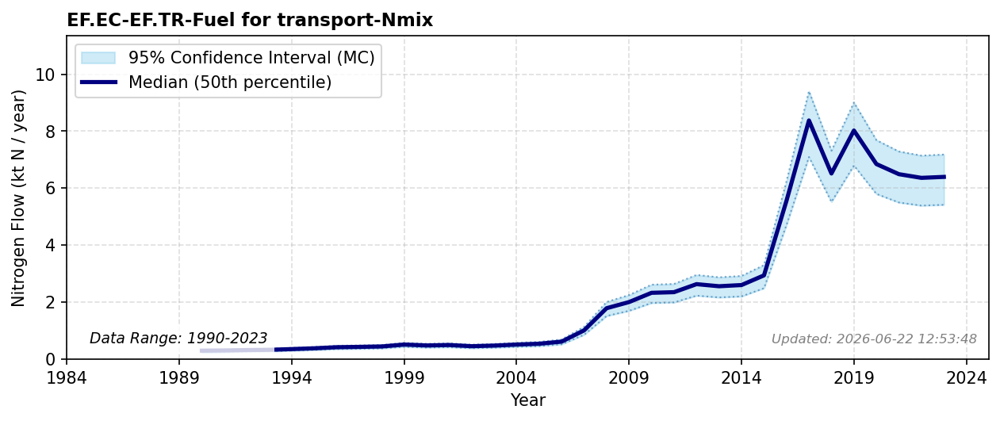

# Fuel for transport

### Flow Description
EF.EC-EF.IC-Fuel for industry-Nmix: As advised by Schäppi et al. (2025), we have found this in the UNFCCC Common reporting tables (Table 1) which gives amount of energy consumed in TJ, together with net caloric values from Table 1.2 in Garg et al. (2006) and nitrogen contents from Table 15 in Schäppi et al. (2025).

### References

* Garg, A., Kazunari, K., & Pulles, T. (2006). Chapter 1. {Introduction. *IPCC} {Guidelines} for {National} {Greenhouse} {Gas} {Inventories*. [https://www.ipcc-nggip.iges.or.jp/public/2006gl/pdf/2_Volume2/V2_1_Ch1_Introduction.pdf](https://www.ipcc-nggip.iges.or.jp/public/2006gl/pdf/2_Volume2/V2_1_Ch1_Introduction.pdf)
* Schäppi, B., Reutimann, J., Bogler, S., & Ehrler, A. (2025). *Detailed Annexes to ECE/EB.AIR/119 – “Guidance document on national nitrogen budgets*. [https://www.clrtap-tfrn.org/sites/default/files/2025-05/Annexes%20to%20the%20Guidance%20Document%20on%20NNB.pdf](https://www.clrtap-tfrn.org/sites/default/files/2025-05/Annexes%20to%20the%20Guidance%20Document%20on%20NNB.pdf)
