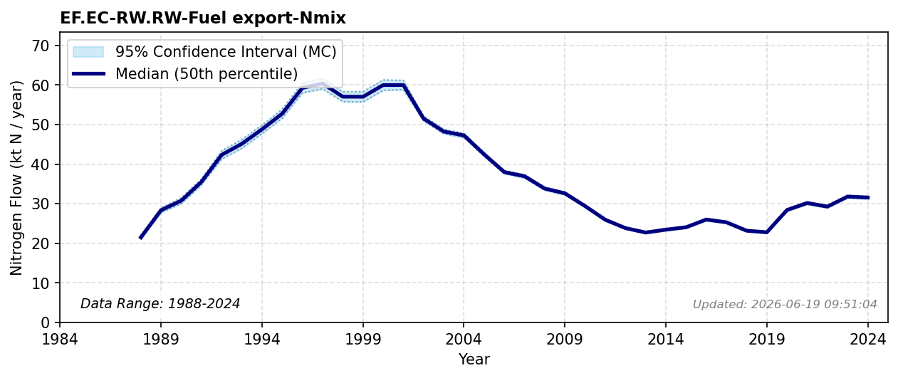

# Fuel export

### Flow Description
EF.EC-RW.RW-Fuel export-Nmix is the nitrogen content in exported fuels. We use trade data in SSB table 08801 to account for all petroleum products excluding those assumed to be used in the transport sector. 

