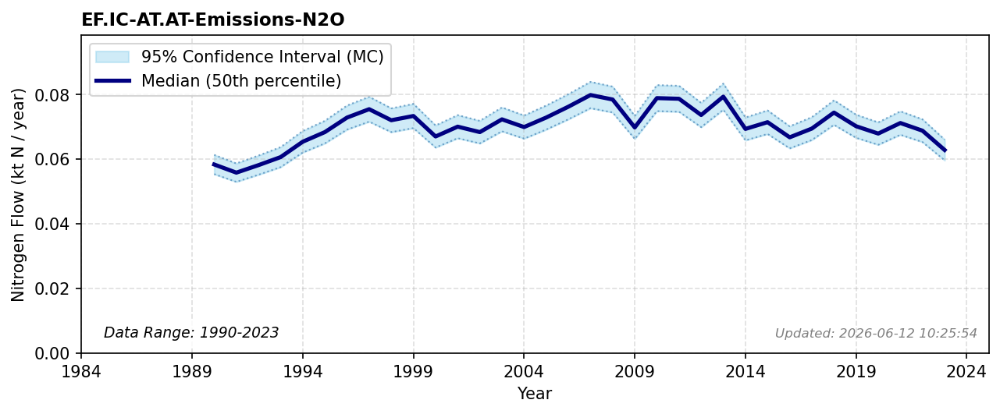

# Industrial emissions (N2O)

### Flow Description
EF.IC-AT.AT-Emissions-N2O is taken from UNFCCC Common Reporting Tables, Table 1 using the categories give in Table 12 by Schäppi et al. (2025).

### References

* Schäppi, B., Reutimann, J., Bogler, S., & Ehrler, A. (2025). *Detailed Annexes to ECE/EB.AIR/119 – “Guidance document on national nitrogen budgets*. https://www.clrtap-tfrn.org/sites/default/files/2025-05/Annexes%20to%20the%20Guidance%20Document%20on%20NNB.pdf
