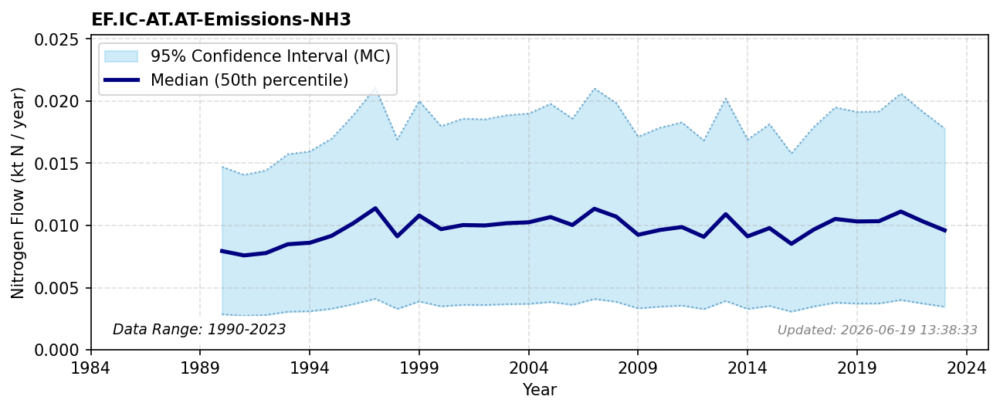

# Industrial emissions (NH3)

### Flow Description
EF.IC-AT.AT-Emissions-NH3 denotes ammonia emissions from fuel combustion in industry. We have used data from CLRTAP Inventory Submissions emep_official_2025 (n.d.) as advised by Schäppi et al. (2025), using the categories given in Table 12.

### References

* Schäppi, B., Reutimann, J., Bogler, S., & Ehrler, A. (2025). *Detailed Annexes to ECE/EB.AIR/119 – “Guidance document on national nitrogen budgets*. https://www.clrtap-tfrn.org/sites/default/files/2025-05/Annexes%20to%20the%20Guidance%20Document%20on%20NNB.pdf
