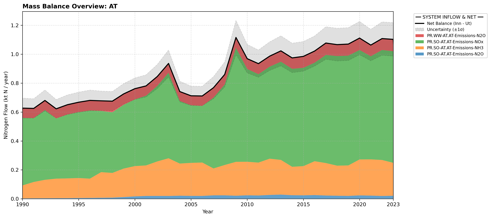

# Pool: Atmosphere (AT)

This section contains all documented nitrogen flows leaving the Atmosphere pool.

---

## Mass Balance Overview (1990-2023)

The chart below illustrates the integrated nitrogen mass balance for **AT**. It includes total system inflows (positive stack), total outflows (negative stack), and the net balance line with estimated uncertainty bounds (±1σ).

