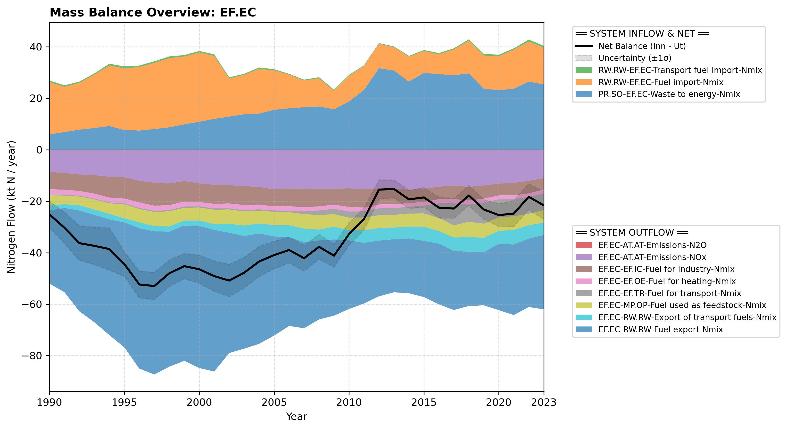

# Subpool: Energy conversion (EF.EC)

---

## Mass Balance Overview (1990-2023)

The chart below illustrates the integrated nitrogen mass balance for **EF.EC**. It includes total system inflows (positive stack), total outflows (negative stack), and the net balance line with estimated uncertainty bounds (±1σ).

This subpool includes extraction of fossil fuels from geological sources, which is a large sector in Norway. Because of this there is no mass balance for EF.EC; nitrogen bound to extracted fuels arise in the sector, and outflows are therefore significantly larger than inflows. 

### Flows that are zero or neglected:

* **EF.EC-AT.AT-Emissions-NH3**: : Data from CLRTAP Inventory Submissions EMEP (2025) as advised by Schäppi et al. (2025), using the categories given in Table 11, give values that are consistently below 0.001 ktN/year, which is negligible in this context.

### References

* EMEP (2025). *Officially reported emission data*. https://www.ceip.at/webdab-emission-database/reported-emissiondata
* Schäppi, B., Reutimann, J., Bogler, S., & Ehrler, A. (2025). *Detailed Annexes to ECE/EB.AIR/119 – “Guidance document on national nitrogen budgets*. https://www.clrtap-tfrn.org/sites/default/files/2025-05/Annexes%20to%20the%20Guidance%20Document%20on%20NNB.pdf
