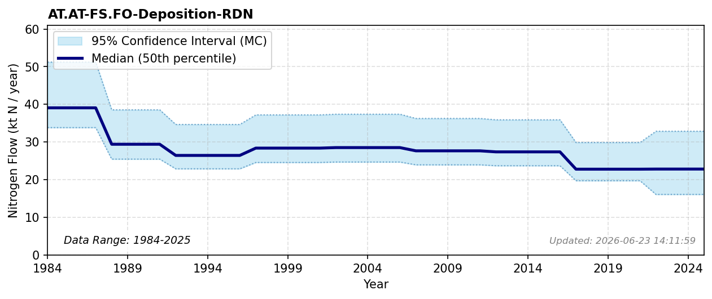

# Reduced N Deposition (Forest)

### Flow Description
**AT.AT-FS.FO-Deposition-RDN**

Atmospheric deposition was calculated using data from NILU which gives gridded deposition data for both oxidized and reduced N as averages for periods 1983-1987, 1988-1992, 1997-2001, 2002-2006, 2007-2011 and 2012-2016. For 2017-2021 we use total NILU data for that period and scale with the distribution across land classes for the previous period. Values after 2021 are extrapolated. To find deposition on different land categories we use the map resource AR5 from NIBIO (NIBIO, 2016). We find the total value of atmospheric deposition to the Norwegian mainland is, as given by NILU, 142 ktN in 2012-2016.

### References

* NIBIO (2016). *AR5*. https://www.nibio.no/tema/jord/arealressurser/arealressurskart-ar5?locationfilter=true
