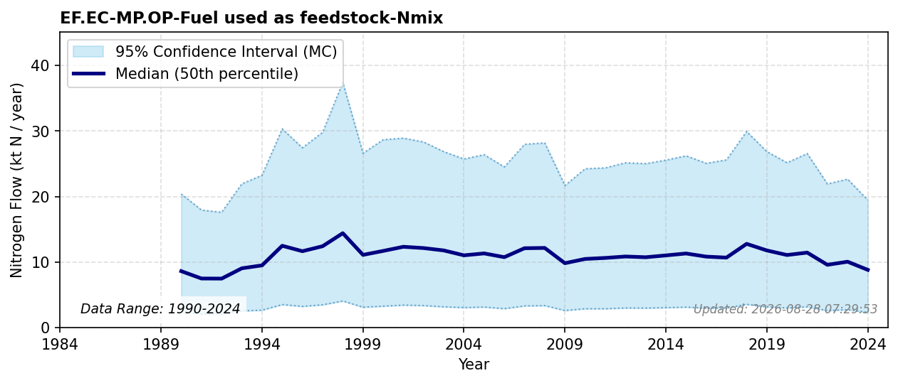

# Fuel used as feedstock

### Flow Description
**EF.EC-MP.OP-Fuel used as feedstock-Nmix** covers coal and oil products consumed as chemical feedstock rather than combusted for energy. We use SSB table 11561 "Energibalansen"'s "Netto innenlands forbruk som råstoff" (net domestic consumption as feedstock) section for consumption volumes by energy product, net caloric values from IPCC (2006), and nitrogen contents for coal and oil feedstock from Schäppi et al. (2025). Other minor feedstock categories listed in the guidelines are neglected as advised by Schäppi et al. (2025).

### References

* Schäppi, B., Reutimann, J., Bogler, S., & Ehrler, A. (2025). *Detailed Annexes to ECE/EB.AIR/119 – “Guidance document on national nitrogen budgets*. [https://www.clrtap-tfrn.org/sites/default/files/2025-05/Annexes%20to%20the%20Guidance%20Document%20on%20NNB.pdf](https://www.clrtap-tfrn.org/sites/default/files/2025-05/Annexes%20to%20the%20Guidance%20Document%20on%20NNB.pdf)
