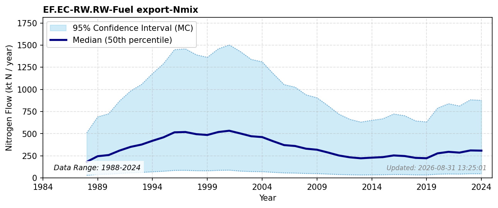

# Fuel export

### Flow Description
EF.EC-RW.RW-Fuel export-Nmix is the nitrogen content in exported fuels. We use trade data in SSB table 08801 to account for all petroleum products excluding those assumed to be used in the transport sector. Crude oil (HS code 2709) dominates this flow, accounting for over 99% of its N content: it is assigned an average N content of 0.25% (range 0.02-1.5%) from Schäppi et al. (2025), giving a total flow on the order of 150-210 ktN/year (2013-2023) - broadly consistent with the Norway-specific crude oil N content and export estimate of Hohmann-Marriott (2025). Natural gas exports (HS code 2711) are not captured here: they are a comparably large export by mass and energy content, but natural gas itself has negligible nitrogen content and is therefore not expected to materially affect the national N budget.

### References

* Hohmann-Marriott, M. F. (2025). A Nitrogen budget for Norway analysis of Nitrogen flows from societal and natural sources (1961–2020). *PLOS ONE, 20*(2), e0313598. [https://doi.org/10.1371/journal.pone.0313598](https://doi.org/10.1371/journal.pone.0313598)
* Schäppi, B., Reutimann, J., Bogler, S., & Ehrler, A. (2025). *Detailed Annexes to ECE/EB.AIR/119 – “Guidance document on national nitrogen budgets*. [https://www.clrtap-tfrn.org/sites/default/files/2025-05/Annexes%20to%20the%20Guidance%20Document%20on%20NNB.pdf](https://www.clrtap-tfrn.org/sites/default/files/2025-05/Annexes%20to%20the%20Guidance%20Document%20on%20NNB.pdf)
