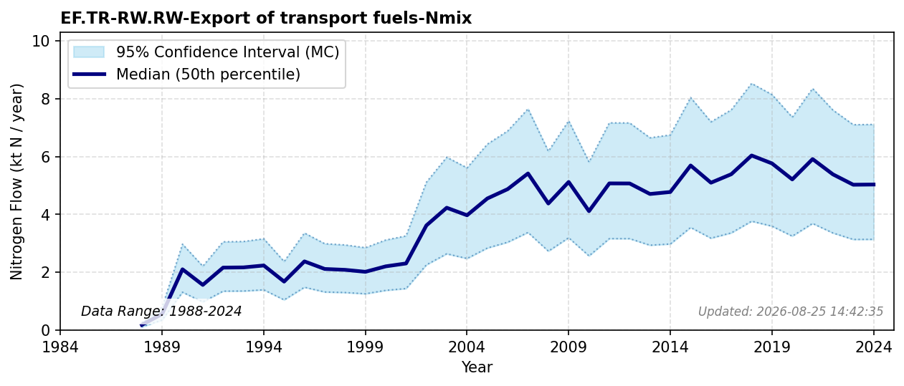

# Export of transport fuels

### Flow Description
EF.TR-RW.RW-Export of transport fuels-Nmix is export of fuels for transport. We use trade data in SSB table 08801 to account for all petroleum products assumed to be used in the transport sector..

