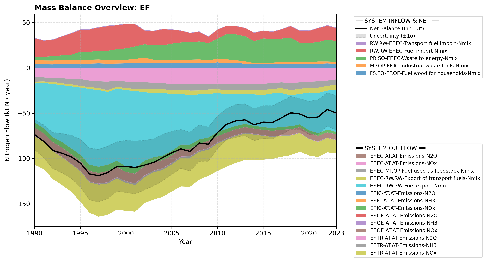

# Pool: Energy and fuels (EF)

In the guidelines, there are N2 flows assigned to and from EF sectors associated with nitrogen conversions in the combustion process...
This pool is divided into four operational sub-pools. Explore them using the side menu or links below:

* [Energy conversion (EF.EC)](subpool_energy_conversion.html)
* [Manufacturing industries and construction (EF.IC)](subpool_industry.html)
* [Transportation (EF.TR)](subpool_transport.html)
* [Other energy and fuels (EF.OE)](subpool_other_energy.html)

---

## Mass Balance Overview (1990-2023)

The chart below illustrates the integrated nitrogen mass balance for **EF**. It includes total system inflows (positive stack), total outflows (negative stack), and the net balance line with estimated uncertainty bounds (±1σ).

