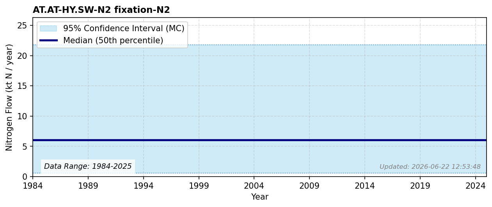

# HY SW N2 fixation N2

### Flow Description
**AT.AT-HY.SW-N2 fixation-N2**

According to NIBIO, the surface water area is 20 457 km2 (https://arealbarometer.nibio.no/nb/norge/). According to [^Schäppi2025], the biological fixation rate can vary between < 0.1 tN/km2 in oligotrophic and mesotrophic lakes to up to 10 tN/km2 in eutrophic lakes. Most lakes in Norway are not eutrophic and we use a low value of 0.1 tN/km2, which gives 2 ktN/year.

### References

*No reference file found.*
