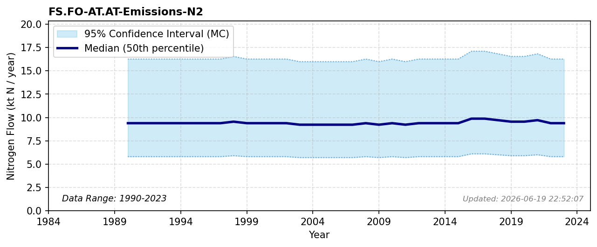

# Forest Emissions (N2)

### Flow Description
Calculated based on N2O emissions from UNFCCC Common reporting tables, Table 4 and assuming a mean N2:N2O ratio of 19.5 as discussed by \\citet{schappi_annexes_2025}.

### References

* Schäppi (2025). *Annexes to the {Guidance} {Document} on {NNB*.
