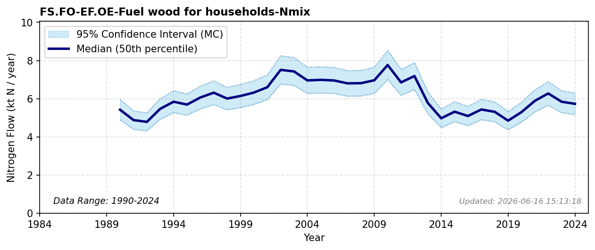

# Fuel Wood for Households

### Flow Description
Taken from SSB table 09702 'Energibalansen. Vedforbruk i boliger og fritidsboliger 1990 – 2024' and we assume a mean N content of 4.0 kg/t (between coniferous and non-coniferous wood; see FS.FO-MP.OP-Industrial round wood-Nmix).

