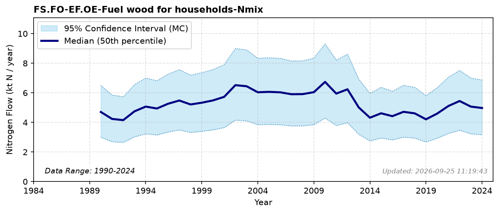

# Fuel Wood for Households

### Flow Description
Taken from SSB table 09702 'Energibalansen. Vedforbruk i boliger og fritidsboliger 1990 – 2024' and we assume a mean N content of 4.0 kg/t, based on the whole-tree N-content values from UNECE/EPNB Annex 4 (3.4 kg/t coniferous, 4.3 kg/t non-coniferous) — the same whole-tree value the Swedish NNB uses for fuel wood, as opposed to the lower stem-only value used for industrial roundwood.

