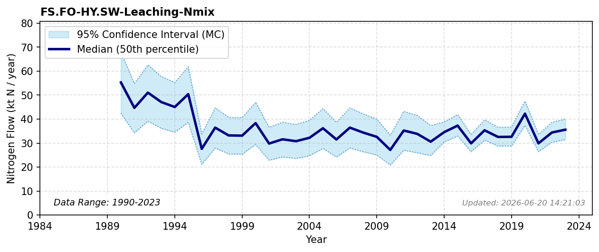

# Forest Leaching

### Flow Description
Found in data supplied by NIVA, produced in the TEOTIL3 model (Sample et al., 2024). For the period 1990-2013, we have used TEOTIL data published by Miljødirektoratet for nitrogen from nitrogen flows that reach the coast, where we have found that values for leaching from forest in the period 2013-2023 are a fraction 0.59 of what is reported by Miljødirektoratet as «Bakgrunn», to within a 2% error.

### References


