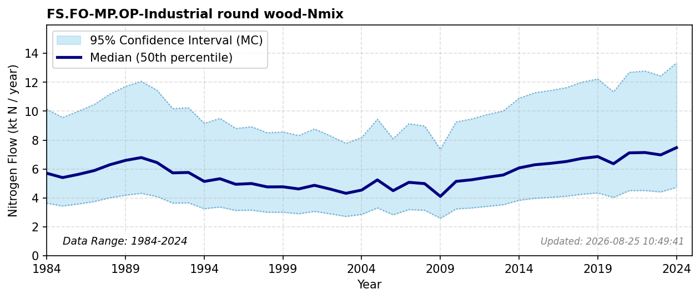

# Industrial Round Wood

### Flow Description
Taken from FAOSTAT Forestry production and trade: industrial roundwood, which gives values under bark.The values given here are very close to those reported in SSB table 08979 “Avvirkning for salg (1 000 m³) 1996 – 2024”. We have also compared with data in Eurostat, which gives total amount of round removed (over or under bark) including use for firewood in households and industry. Following the Swedish NBB (Jutterström et al., 2020), we use an average wood density of 0.45 t/m3 for all wood categories, and stem-only N-contents of 1.2 kg/t for coniferous and 1.4 kg/t for non-coniferous trees, since roundwood removals consist mainly of stem wood, not foliage, branches and roots. The whole-tree value is instead used for fuel wood (see FS.FO-EF.OE-Fuel wood for households-Nmix).ktN/mill m3 wood harvested.

### References

* Jutterström, S., Stadmark, J., & Moldan, F. (2020). *Swedish National Nitrogen Budget – Forest and semi-natural vegetation*.
