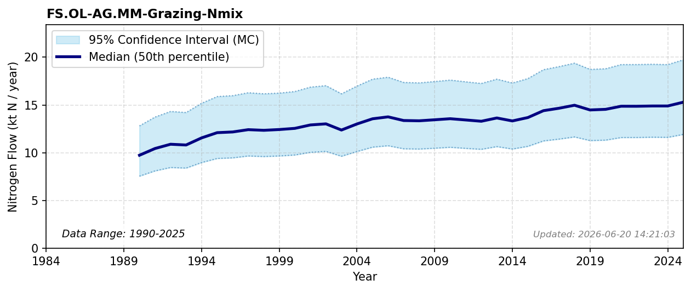

# Organised Grazing

### Flow Description
Calculated using data from NIBIO on organised grazing (nibio_organised_grazing_2025) together with estimated fodder intake for different animal groups...

### References

* Missing reference data for key: `nibio_organised_grazing_2025`
