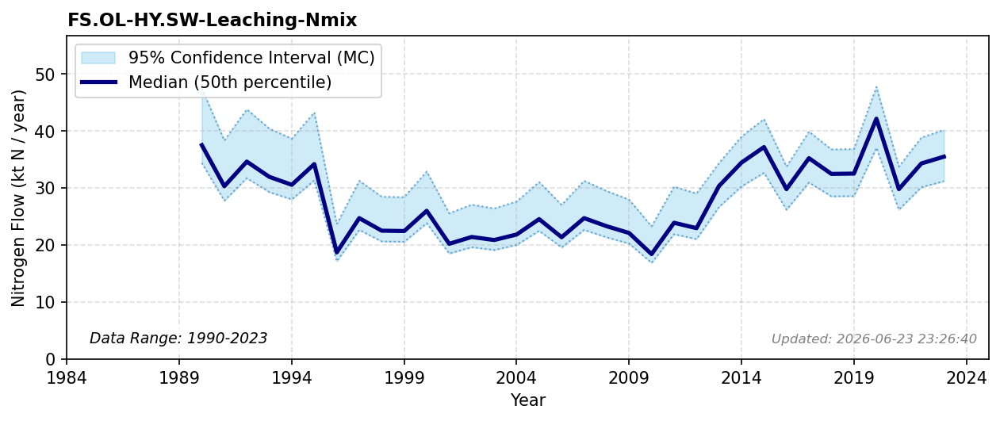

# Other Land Leaching

### Flow Description
Found in data supplied by NIVA, produced in the TEOTIL3 model (Sample et al., 2024),

### References

* Sample, J. E., Jackson-Blake, L., Vogelsang, C., & Kaste, Ø. (2024). *TEOTIL3}: {En} modell for beregning av kildebaserte tilførsler via elver og direktetilførsler til kyst*.
