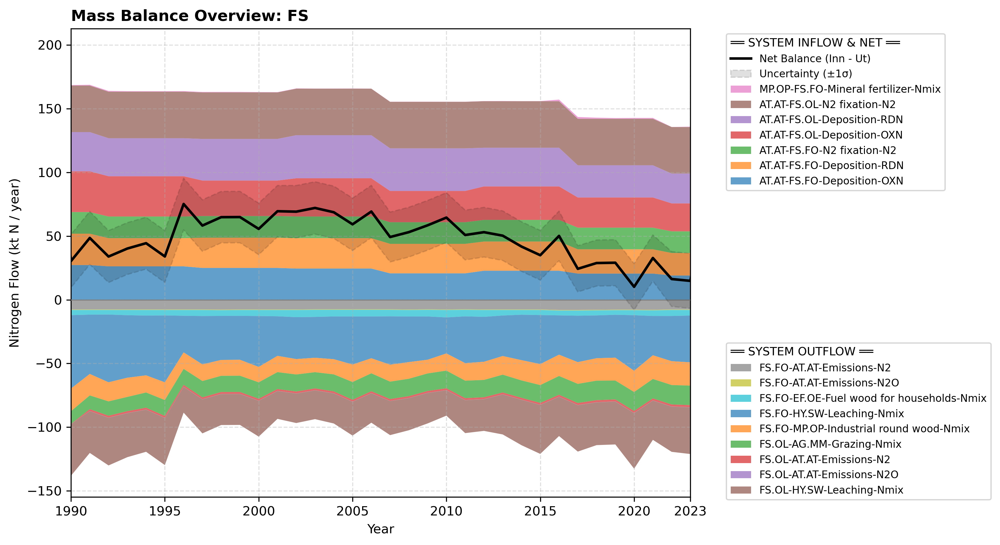

# Pool: Forests and semi-natural vegetation (FS)

Because of limited data on OL and because data on leaching are combined for WL and OL, we have chosen to combine WL and OL into the OL subpool in this study.

We have considered including meat from hunting of wild animals in flows from this subpool, but chosen not to. According to steinset_2021 (n.d.), the amount of wild game caught in 2019 was around 6000 tonnes, which gives around 0.2 ktN and thus smaller than any of the included flows.

This pool is divided into two operational sub-pools. Explore them using the side menu or links below:

* [Forests (FS.FO)](subpool_forests.html)
* [Other Land (FS.OL)](subpool_other_land.html)

---

## Mass Balance Overview (1990-2023)

The chart below illustrates the integrated nitrogen mass balance for **FS**. It includes total system inflows (positive stack), total outflows (negative stack), and the net balance line with estimated uncertainty bounds (±1σ).

### References

* Missing reference data for key: `steinset_2021`
