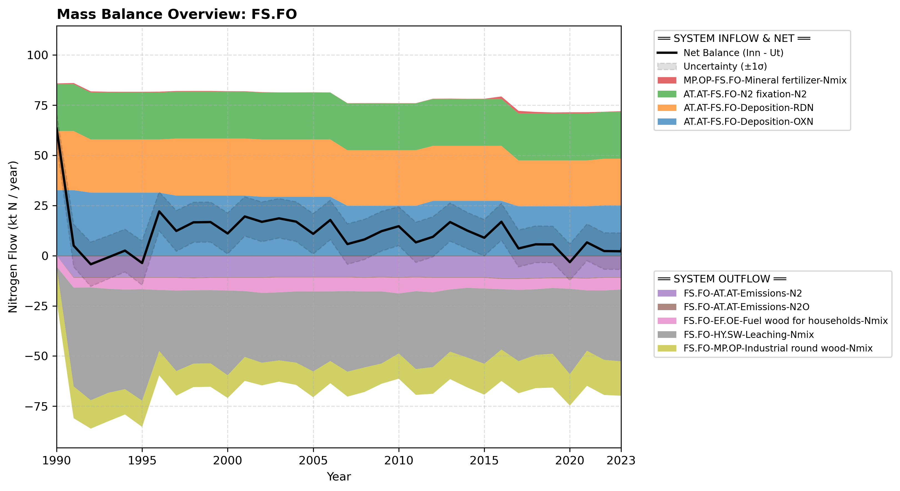

# Subpool: Forests (FS.FO)

---

## Mass Balance Overview (1990-2023)

The chart below illustrates the integrated nitrogen mass balance for **FS.FO**. It includes total system inflows (positive stack), total outflows (negative stack), and the net balance line with estimated uncertainty bounds (±1σ).

### Flows that are zero or neglected:

* **FS.FO-AT.AT-Emissions-NOx** is neglected because no values are reported in the CRLTAP/WebDab categories 4A1 and 4A2 (forest soils).
* **FS.FO-EF.EC-Fuel wood for co-fired power plants-Nmix** is set to zero because we assume such facilities do not exist in Norway.
* **FS.FO-EF.IC-Fuel wood for industry-Nmix** is ignored because wood is typically not harvested specifically to be used for fuel in industry in Norway. The use of wood waste in the producing industry is reported as self-produced bioenergy in the SSB statistic, but this is a flow that goes from MP.OP to EF.IC.
* Because the N-flow in forest fertilization is not large, we have chosen to ignore the associated N2O emissions that were included in the Swedish NBB (Moldan et al., 2025).
