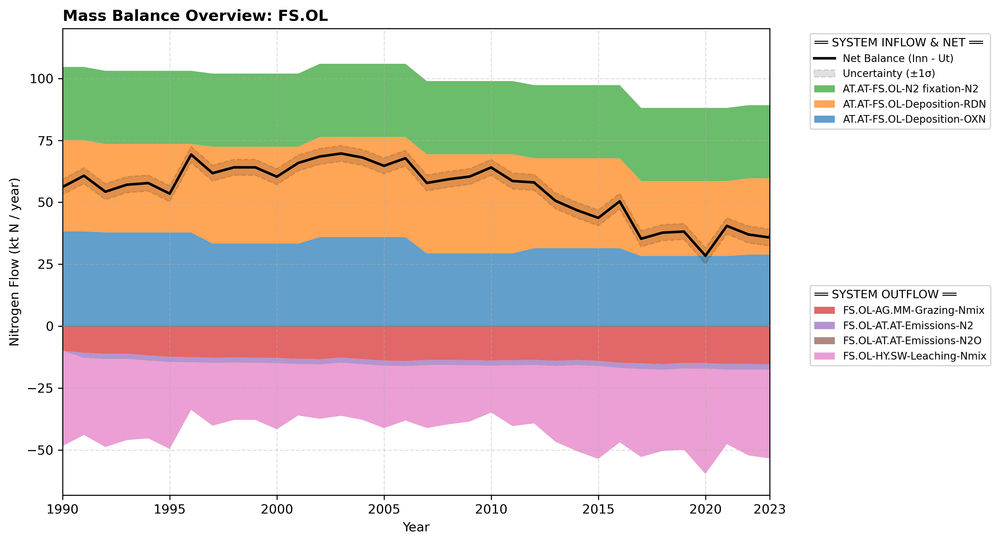

# Subpool: Other land (FS.OL)

---

## Mass Balance Overview (1990-2023)

The chart below illustrates the integrated nitrogen mass balance for **FS.OL**. It includes total system inflows (positive stack), total outflows (negative stack), and the net balance line with estimated uncertainty bounds (±1σ).

### Flows that are zero or neglected:

* **FS.OL-AT.AT-Emissions-NOx** is neglected because no values are reported in the CRLTAP/WebDab categories 4F1 and 4F2 (wetlands / other land NOx).
