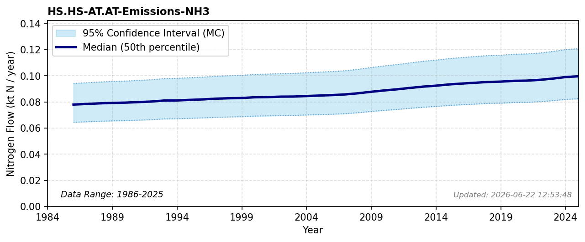

# Ammonia Body Emissions

### Flow Description
**HS.HS-AT.AT-Emissions-NH3** are ammonia emissions from the human body. We use population data from SSB together with SSB data on smoking (table 05307) and assume that daily smokers smoke 750 cigarettes per year, while occasional smokers smoke 100 per year. This data is used with equation 46 in Schäppi et al. (2025), taken from Sutton (2000), which relates ammonia emissions to age and cigarette smoking.

### References

* Schäppi, B., Reutimann, J., Bogler, S., & Ehrler, A. (2025). *Detailed Annexes to ECE/EB.AIR/119 – “Guidance document on national nitrogen budgets*. [https://www.clrtap-tfrn.org/sites/default/files/2025-05/Annexes%20to%20the%20Guidance%20Document%20on%20NNB.pdf](https://www.clrtap-tfrn.org/sites/default/files/2025-05/Annexes%20to%20the%20Guidance%20Document%20on%20NNB.pdf)
